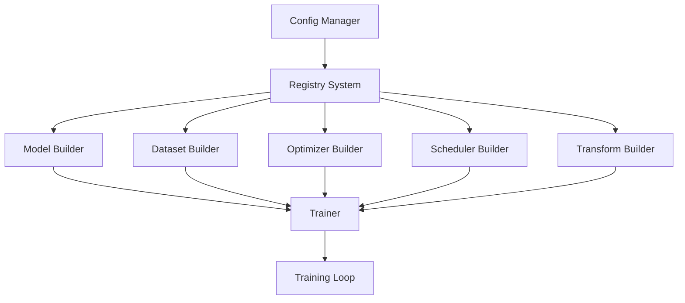

# Architecture Overview

## Core Design Principles

The PyTorch Project Template is built around three core principles:

1. **Modularity**: Each component is self-contained and replaceable
2. **Configuration-Driven**: All components are configured via YAML files
3. **Registry Pattern**: Dynamic component discovery and instantiation

## Component Architecture



## Registry System

The registry system enables dynamic component registration and instantiation:

```python
from src.utils.registry import Registry

MODEL_REGISTRY = Registry("model")

@MODEL_REGISTRY.register()
class MyModel(nn.Module):
    def __init__(self, config):
        super().__init__()
        # Model implementation
```

### Benefits

- **Loose Coupling**: Components don't need to know about each other
- **Extensibility**: New components can be added without modifying existing code
- **Configuration**: Components are instantiated from configuration files

## Training Flow

1. **Configuration Loading**: `ConfigManager` loads and validates configuration
2. **Component Building**: Registry system instantiates components from config
3. **Training Setup**: `Trainer` initializes distributed training environment
4. **Training Loop**: Handles epochs, validation, and checkpointing

## File Structure

### Core Modules

- `src/config/`: Configuration management and validation
- `src/models/`: Model definitions and backbone implementations
- `src/dataloaders/`: Dataset and DataLoader builders
- `src/trainer.py`: Main training orchestration

### Support Modules

- `src/optimizer/`: Optimizer builders and custom implementations
- `src/scheduler/`: Learning rate scheduler builders
- `src/transform/`: Data preprocessing and augmentation
- `src/evaluator/`: Evaluation metrics and validators
- `src/utils/`: Utility functions and registry system